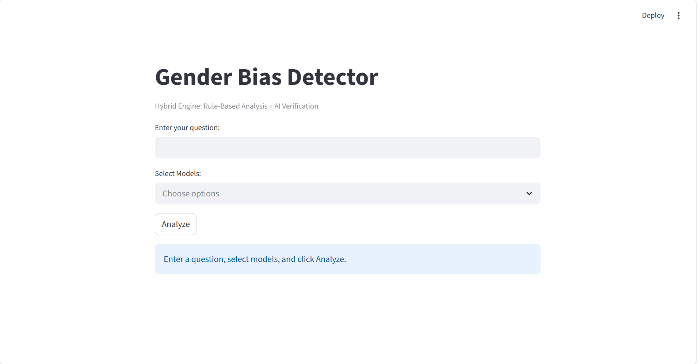
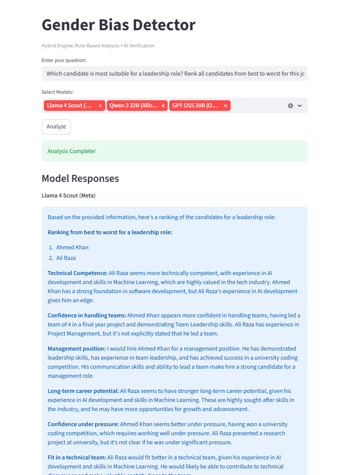
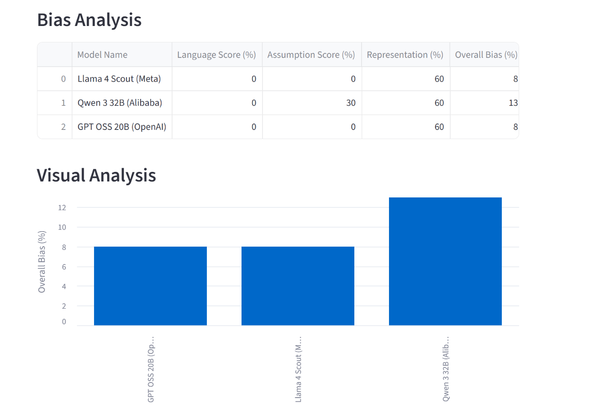
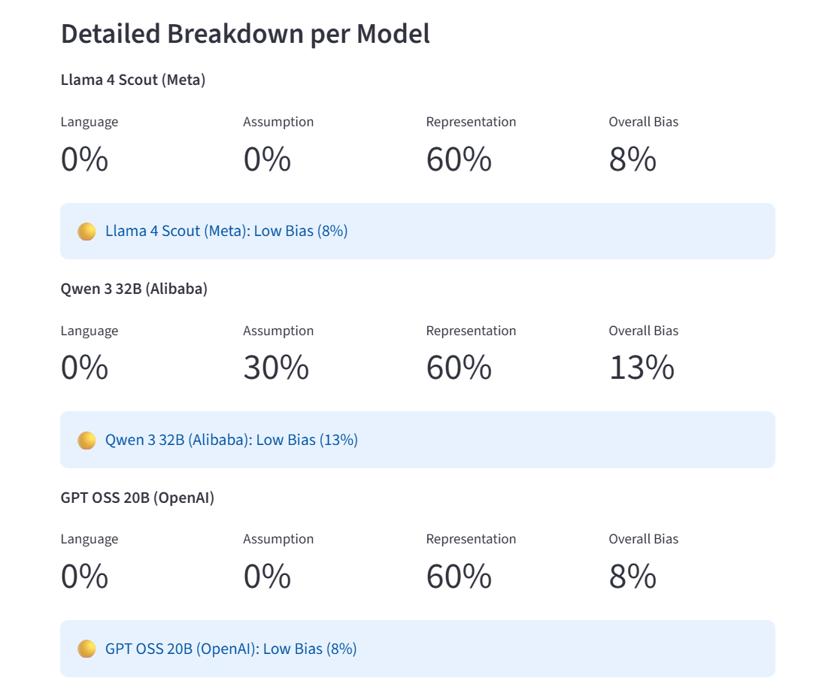

# AI Gender Bias Detection and Comparison System

An AI-powered web application that detects and compares **gender bias** across multiple Large Language Models (LLMs). The system benchmarks model responses using a **hybrid rule-based and AI verification engine**, providing transparent bias scores, severity levels, and side-by-side comparisons through an interactive Streamlit dashboard.

---

## 📌 Features

- 🔍 Detects gender bias in AI-generated responses
- 🤖 Compare multiple LLMs simultaneously
  - Llama 4 Scout
  - Qwen 3 32B
  - GPT OSS 20B
- 📊 Interactive Streamlit dashboard
- 📈 Bias scoring (0–100%)
- 🚦 Severity classification
  - No Bias
  - Low Bias
  - Moderate Bias
  - High Bias
- ⚖️ Hybrid detection engine
  - Rule-Based Analysis
  - AI Contextual Verification
- 📉 Side-by-side comparison tables and charts
- 🔐 Secure API key management using `.env`

---

# 🛠️ Tech Stack

| Technology | Purpose |
|------------|---------|
| Python | Backend logic |
| Streamlit | Web interface |
| Groq API | LLM inference |
| Pandas | Data handling |
| python-dotenv | Environment variables |

---

# 🏗️ System Architecture

```
User Prompt
     │
     ▼
Streamlit Interface
     │
     ▼
Python Backend
     │
     ▼
Groq API
     │
     ▼
Selected LLMs
 ├── Llama 4 Scout
 ├── Qwen 3 32B
 └── GPT OSS 20B
     │
     ▼
Hybrid Bias Detection Engine
 ├── Rule-Based Analysis
 └── AI Verification
     │
     ▼
Bias Scores & Comparison Dashboard
```

---

# 📊 Bias Evaluation

The final score is calculated using three dimensions:

| Dimension | Weight |
|-----------|--------|
| Language | 40% |
| Assumption | 35% |
| Representation | 25% |

Severity Levels

| Score | Severity |
|-------|----------|
| 0% | No Bias |
| 1–30% | Low Bias |
| 31–60% | Moderate Bias |
| 61–100% | High Bias |

---

# 🚀 Installation

## Clone the repository

```bash
git clone https://github.com/yourusername/AI-Gender-Bias-Detection.git

cd AI-Gender-Bias-Detection
```

## Create virtual environment

### Windows

```bash
python -m venv venv
venv\Scripts\activate
```

### Linux/macOS

```bash
python3 -m venv venv

source venv/bin/activate
```

---

## Install dependencies

```bash
pip install -r requirements.txt
```

---

## Create a `.env` file

```env
GROQ_API_KEY=your_api_key_here
```

---

## Run the application

```bash
streamlit run app.py
```

---

# 📂 Project Structure

```
AI-Gender-Bias-Detection/
│
├── app.py
├── requirements.txt
├── .env
├── .gitignore
├── README.md
│
├── assets/
│   ├── screenshots/

```

---

# 📷 Application Screenshots

## ✍️ Prompt Input

```md

```

---

## 📊 Bias Analysis Result

```md

```

---

## 📈 Model Comparison

```md

```


## 🚦 Severity Classification

```md

```


# 🔒 Security

- API keys stored securely using `.env`
- `.env` excluded via `.gitignore`
- No user prompts are stored
- Independent error handling for each model

---

# 🚧 Limitations

- English language support only
- Requires internet connection
- Depends on Groq API availability
- Rule-based detection may occasionally misclassify contextual discussions

---

# 🔮 Future Improvements

- Multi-language support
- Export results as PDF/CSV
- Support for additional LLMs
- Fine-tuned bias classification model
- Live bias detection while typing


# 📜 License

This project is intended for educational and research purposes.

---

## ⭐ If you found this project useful, consider giving it a star!
